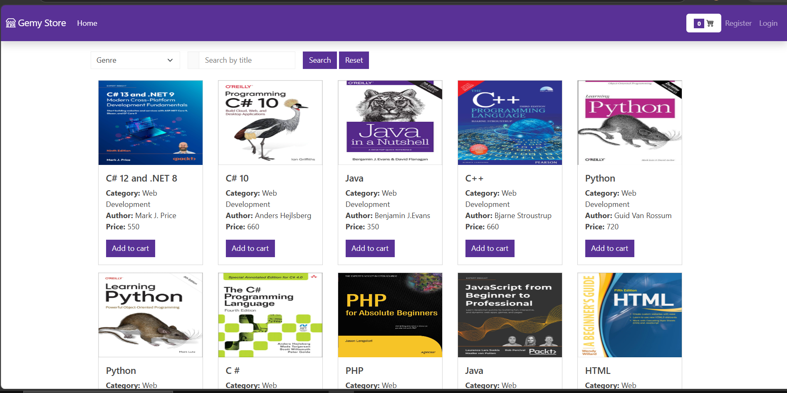
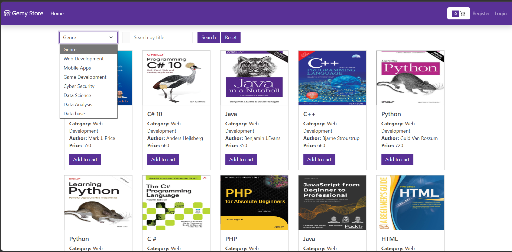
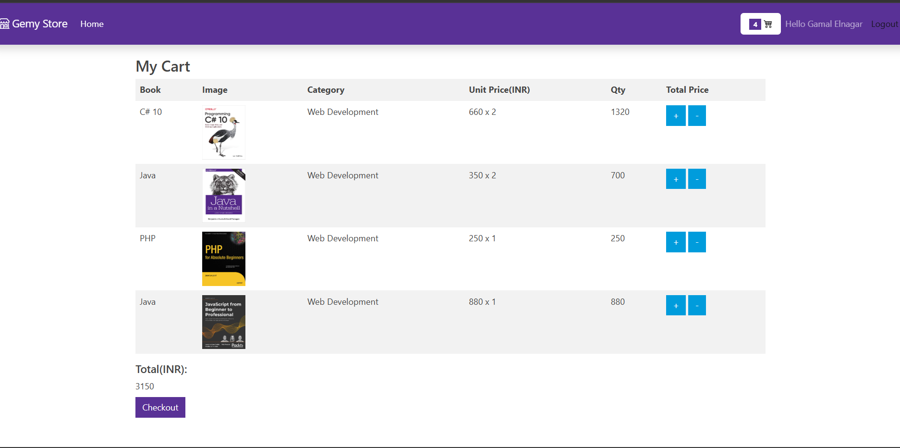
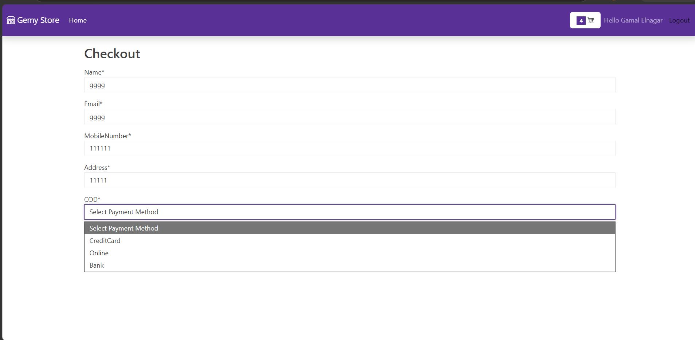
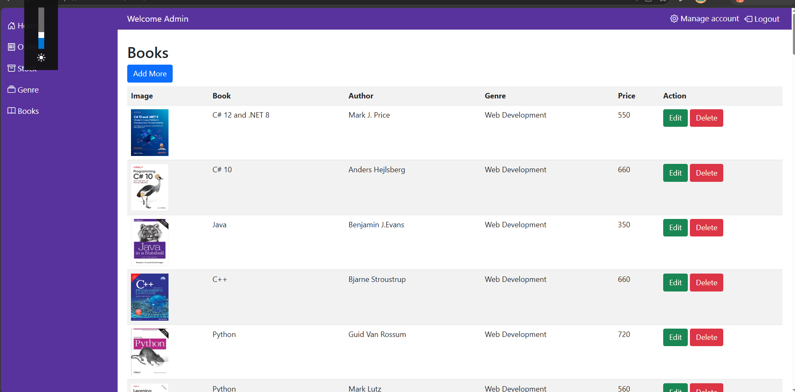
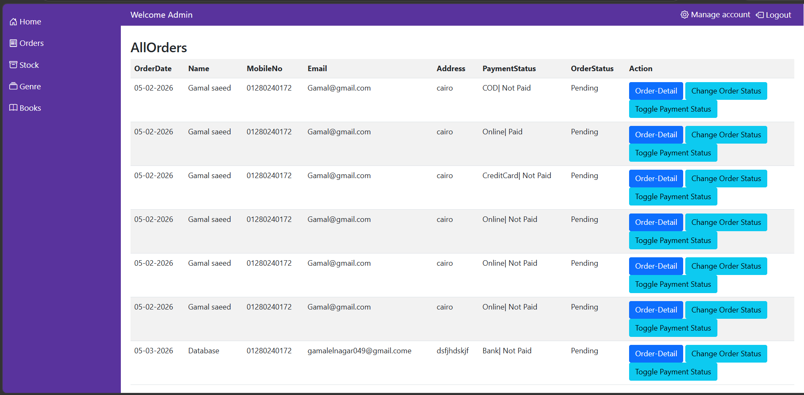
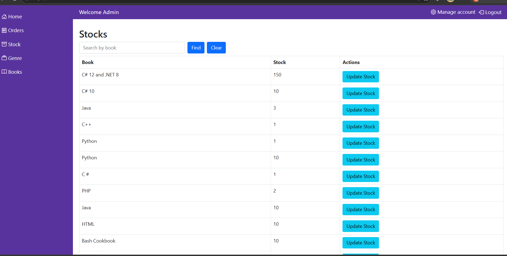
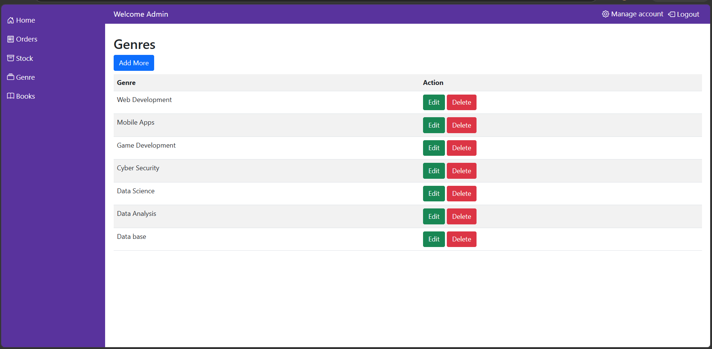

# Digital Library Management System

This project is a comprehensive Digital Library Management System built with **ASP.NET Core MVC**. It is designed to organize book browsing, manage inventory, and streamline both order tracking and effective product management within a library environment.

## 🚀 Overview
The system provides an interactive interface for users to browse a wide collection of educational and technical books. It includes a robust admin dashboard that serves as a centralized hub for content curation and systematic product management.

## 🛠 Tech Stack
* **Framework:** ASP.NET Core MVC
* **Database:** MS SQL Server
* **ORM:** Entity Framework Core
* **Frontend:** HTML, CSS, JavaScript, Bootstrap

## ✨ Key Features
* **Modern User Interface:** Easy book browsing with filtering and search functionality by genre.
* **Digital Cart System:** Users can add books to their cart, review quantities, and manage their selection.
* **Product Management & Admin Dashboard:**
    * **Inventory & Product Lifecycle:** Comprehensive management of the product catalog, including adding, updating, and removing book titles.
    * **Order Management:** Tracking user orders, managing transactions, and updating status (e.g., Pending, Paid).
    * **Category Management:** Efficient product categorization to organize the library catalog into distinct, navigable sections.

## 📂 Project Structure
The project follows a modular architecture to ensure maintainability and scalability:
* `Controllers/`: Handles the application logic and user requests.
* `Models/`: Defines the system entities such as Books, Orders, and Categories.
* `Views/`: Contains the Razor views for the user interface.
* `Data/`: Manages database context and migrations.
* `Repositories/`: Implements the repository pattern to abstract data access logic and support efficient product management.

## 🤝 Contributing
Contributions are welcome! If you have any suggestions to improve the code or add new features, please feel free to open an "Issue" or submit a "Pull Request."

---

## 📸 Screenshots

### Home Page

### Filtering

### Search

### Shopping Cart

### Checkout info

### Books Catalog

### Orders Dashboard

### Stock Management

### Genres Management

*Developed by: [Gamal Saeed Elnagar]*
